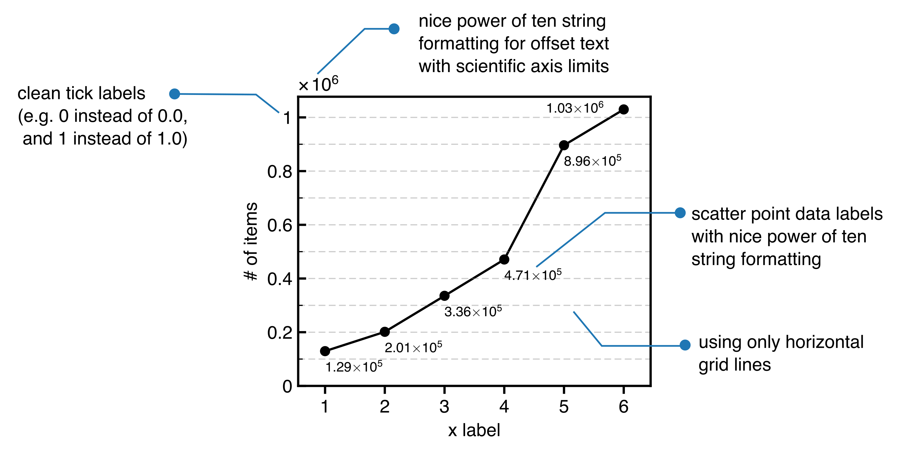

# Scatter plot with data labels

This example illustrates several non-default matplotlib gems. These are
* data labels for scatter points using mpl's annotate function with data coordinates
* scientific string formatting for data labels
* scientific string formatting for large y scale values (offset text handling for scientific axis)
* clean str formatting in conjunction with scientific axis labeling
* horizontal grid lines only using `ax1.yaxis.grid(...)`
